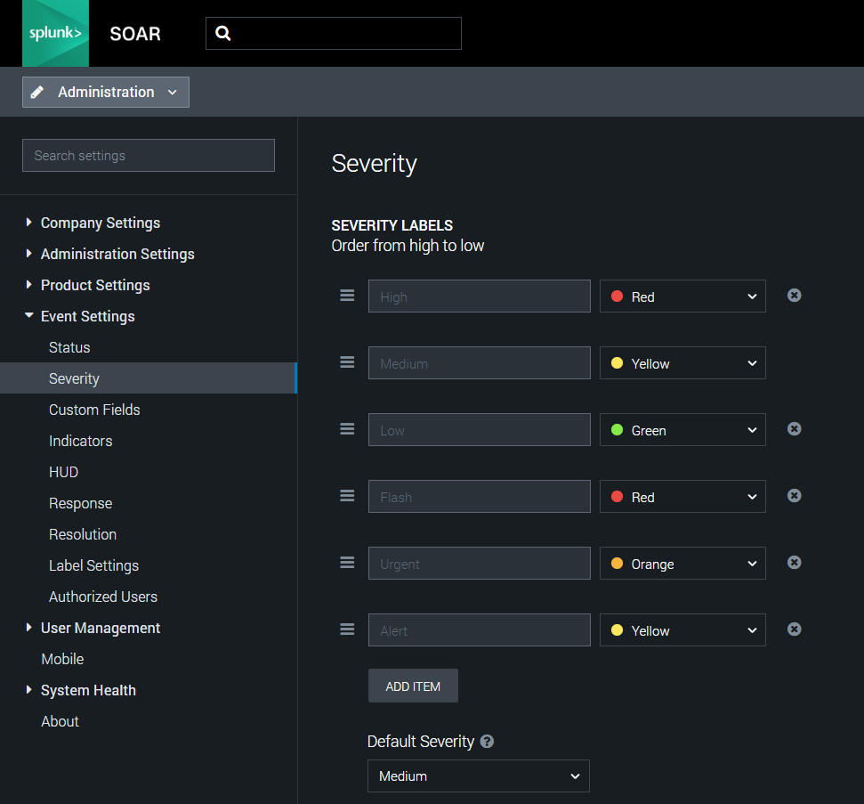

[comment]: # "Auto-generated SOAR connector documentation"
# Dataminr Pulse for Splunk SOAR

Publisher: Dataminr  
Connector Version: 1.2.0  
Product Vendor: Dataminr  
Product Name: Dataminr Pulse  
Product Version Supported (regex): ".\*"  
Minimum Product Version: 5.5.0  

Pulse’s AI-powered real-time intelligence integrates into Splunk SOAR workflows for faster detection and response

[comment]: # " File: README.md"
[comment]: # ""
[comment]: # "    Copyright (c) 2023-2024 Dataminr"
[comment]: # ""
[comment]: # "    This unpublished material is proprietary to Dataminr."
[comment]: # "    All rights reserved. The methods and"
[comment]: # "    techniques described herein are considered trade secrets"
[comment]: # "    and/or confidential. Reproduction or distribution, in whole"
[comment]: # "    or in part, is forbidden except by express written permission"
[comment]: # "    of Dataminr."
[comment]: # ""
[comment]: # "    Licensed under the Apache License, Version 2.0 (the 'License');"
[comment]: # "    you may not use this file except in compliance with the License."
[comment]: # "    You may obtain a copy of the License at"
[comment]: # ""
[comment]: # "        http://www.apache.org/licenses/LICENSE-2.0"
[comment]: # ""
[comment]: # "    Unless required by applicable law or agreed to in writing, software distributed under"
[comment]: # "    the License is distributed on an 'AS IS' BASIS, WITHOUT WARRANTIES OR CONDITIONS OF ANY KIND,"
[comment]: # "    either express or implied. See the License for the specific language governing permissions"
[comment]: # "    and limitations under the License."
[comment]: # ""
## Explanation of the Asset Configuration Parameters

The asset configuration parameters affect 'test connectivity' and some other actions of the
application. The parameters related to test connectivity action are Client ID and Client Secret.

-   **Client ID:** Client ID.
-   **Client Secret:** Client Secret.

## Explanation of the Actions' Parameters

-   ### Test Connectivity

    This action will check the status of the Dataminr Pulse API endpoint and test connectivity of
    Splunk SOAR to the Dataminr Pulse instance. It can be used to generate a new token.  
    The action validates the provided asset configuration parameters. Based on the response from the
    API call, the appropriate success and failure message will be displayed when the action gets
    executed.

-   ### On Poll

    This polling is to ingest the dynamic alerts of a particular watchlist that is configured on
    this asset. The user can provide the watchlist names to ingest the alerts from, or provide the
    query and set the pagesize for polling. The user can also filter the results of the alert
    response, based on alert type.  

    -   **Manual Polling (POLL NOW)**

          

        -   It will fetch the data when initiated, as per the corresponding asset configuration
            parameters. It does not store the last run context of the fetched data.

    -   **Schedule/Interval Polling**

          

        -   **Schedule Polling:** The ingestion action can be triggered at every specified time
            interval.
        -   **Interval Polling:** The ingestion action can be triggered at every time range
            interval.
        -   It will fetch the data every time, based on the stored context from the previous
            ingestion run. It stores the last run context of the fetched data. It starts fetching
            data based on the combination of the values of stored context for the previous ingestion
            run.
        -   **NOTE:** If the user changes the configuration related to 'list names' or 'query'
            parameter while the schedule/interval polling is running, then the next polling cycle
            will start fetching the latest data according to the updated configured parameters.

    <!-- -->

    -   **Action Parameter: List names**

          

        -   This parameter accepts comma-seperated names of the watchlist and it is required if the
            user does not use this query parameter. Example: Company Cyber Alerts, Supply Chain
            Partner Cyber Alerts
        -   If any one of the list names is invalid in the comma-separated string, the action will
            skip that list name and continue with the valid ones.  
        -   **NOTE:** The list names asset parameter is case-sensitive and the user must provide the
            exact case match of the watchlist

    -   **Action Parameter: Query**

          

        -   This parameter accepts the search value for all the watchlists and it is required if we
            do not use the list names parameter. Example: ("Test" AND "Application") OR ("text" AND
            "json")
        -   The query parameter is case-insensitive.
        -   **Note:** If the user provides a list name and query both, then the action will return
            queried alerts from that particular watchlist only.

        **NOTE:** For polling, either 'list names' or 'query' must be provided to ingest alerts.

    -   **Action Parameter: Page size for polling**

          

        -   This parameter allows the user to limit the number of alerts in the response. It expects
            a numeric value as an input.
        -   The default value is 40 for this parameter.

    -   **Action Parameter: Alert type**

          

        -   This parameter allows additional filtering above list names and query. When any of
            "Alert, Urgent, Flash" is selected, it just ingests the alerts with specific alert type
            from the alerts fetched by the API with configured pagesize. If "All" is selected, all
            the types of alerts will be ingested.
        -   **NOTE:** The severity of containers, Alert artifacts, and it's cyber artifacts is
            according to the alert type of the first ingested alert. If the alert type is not
            present in the API response of any alert, then by default the severity is set to
            'Alert'. If related alert artifacts are ingested in the same container and have
            different severity, then the higher severity level will be set for the respective
            container and the new Alert artifacts and its cyber artifacts will have the severity of
            it's alert only. Thus, the severity of already ingested container would update only when
            an alert of higher severity than the existing one is ingested in the same container.
        -   The priority order of severity levels (high to low): Flash \> Urgent \> Alert

    -   **Examples:**

        -   List the alert details with the list names 'Test alert 1,Test alert 2' and the query
            ("Test" AND "Application") OR ("text" AND "json") with page size for polling as 10:
            -   List names = Test alert 1,Test alert 2
            -   Query = ("Test" AND "Application") OR ("text" AND "json")
            -   Page Size for Polling = 10

          

        ### Addition of Custom Severities on Ingested Data

        -   This app needs to add custom severity levels based on alert type. Adding the severity in
            the Splunk SOAR platform is handled by the Dataminr Pulse app on running the Test
            Connectivity.

        -   This app requires the proper app-level permissions to do so. Please note, for the
            Dataminr Pulse app to apply these custom severities to the Artifacts ingested via API
            queries using On Poll, you must make sure that the automation user you use has the
            correct permissions.

        -   By default, the automation user is selected to run the Dataminr Pulse for Splunk SOAR
            ingestion action. (See **Asset Configuration** \> **Asset Settings** \> **Advanced** )
            The automation user does **NOT** have access to view or edit **System Settings** , which
            includes the permission to view the custom severities on your instance. This will cause
            your On Poll action to fail since your user cannot add the custom severities (Flash,
            Urgent, and Alert) on your instance.

        -   In order to solve this problem, you must create a user of type **Automation** and assign
            this user a Role that has permissions to view or edit **System Settings** (
            **Administration** \> **User Management** \> **Users** **\> + User** button on the top
            right corner). Then, choose this user in your Dataminr Pulse for Splunk SOAR **Asset
            Settings** under **Advanced** and you will be able to successfully apply custom
            severities to your ingested data.  
              
            **Administration** \> **User Management** \> **Users** **\> + User**
              
              
              
            **Administration** \> **User Management** \> **Roles & Permissions** **\> + Role**
              
              
              
            **Asset Settings** \> **Advanced**
              
              
              

              
            **NOTE:** If an error perists related to severity addition, it would be visible in logs
            while data ingestion. In this case, the user is advised to add the severity manually
            using these steps:

            -   On the SOAR platform, navigate to **Administration->Event Settings->Severity**

            -   Click on **ADD ITEM** and add severity type 'Flash' and select color as 'Red'. Click
                on **Done** .

            -   Click on **ADD ITEM** and add severity type 'Urgent' and select color as 'Orange'.
                Click on **Done** .

            -   Click on **ADD ITEM** and add severity type 'Alert' and select color as 'Yellow'.
                Click on **Done** .

            -   **NOTE:** The severity types are case-sensitive hence, user is advised to add
                severity in **same case and same order** as mentioned above and as shown in below
                image.

                  
                

-   ### Get Lists

    Retrieves all the watchlists of user's account.  
    The action has no parameters.

-   ### Get Alerts

    Fetch the details of the alerts from the Dataminr platform for the given List ID or query.

    -   **Action Parameter: List ID**

          

        -   This parameter accepts comma-seperated ids of the watchlist and it is required if we do
            not use the query parameter. Example: 1234567,1234568
        -   If any one of the List IDs is invalid in the comma-separated string, the action will
            skip that List ID and continue with the valid ones.  
        -   Users can get the list ID by executing the "get lists" action.

    -   **Action Parameter: Use asset configured lists**

          

        -   This parameter is the optional boolean parameter. On marking it as true, the list id
            will be considered the one which is configured in the asset parameter.
        -   If the user provides a list id and marks this boolean parameter as true, then priority
            will be given to list ids.

    -   **Action Parameter: Query**

          

        -   This parameter accepts the search value for all the watchlists and it is required if we
            do not use the query parameter. Example: ("Test" AND "Application") OR ("text" AND
            "json")
        -   The query parameter is case-insensitive.
        -   **Note:** If the user provides a list id and query both, then the action will return
            queried alerts from that particular watchlist only.

        **Note:** User need to provide either 'list id' in action parameter or valid 'list names' in
        asset configuration parameter or 'query' to fetch alerts.

    -   **Action Parameter: Max Alerts**

          

        -   This parameter allows the user to limit the number of alerts in the response. It expects
            a numeric value as an input.
        -   The default value is 40 for this parameter.

    -   **Action Parameter: From**

          

        -   This parameter points to a cursor that you want any alerts after.

    -   **Action Parameter: To**

          

        -   This parameter points to a cursor that you want any alerts before.

        **Note:** Only one of "from" or "to" parameter can be included at a time.

    -   **Examples:**
        -   List the alert details with the List ID '1234567,1234568' and the query ("Test" AND
            "Application") OR ("text" AND "json") with max alerts as 10:
            -   List ID = 1234567,1234568
            -   Query = ("Test" AND "Application") OR ("text" AND "json")
            -   Max Alerts = 10

-   ### Get Related Alerts

    Fetch the details of the asset from the Dataminr platform for the given Alert ID.

    -   **Action Parameter: Alert ID**

          

        -   This parameter is the unique key for any particular alert and it is a required
            parameter.  
        -   If the Alert ID provided is invalid, the action will return an empty response.
        -   Users can get the alert ID by executing the "get alerts" action.

    -   **Action Parameter: Include Root**

          

        -   This parameter accepts a boolean value and it is optional.
        -   This parameter is used if the user wants the root alert (provided alert) in the get
            related alerts response.

    -   **Examples:**
        -   List the alerts detail with the Alert ID '01234567-1672385801826-3' with includeRoot as
            True.

              

            -   Alert ID = 01234567-1672385801826-3
            -   includeRoot = True

### Configuration Variables
The below configuration variables are required for this Connector to operate.  These variables are specified when configuring a Dataminr Pulse asset in SOAR.

VARIABLE | REQUIRED | TYPE | DESCRIPTION
-------- | -------- | ---- | -----------
**client_id** |  required  | string | Client ID
**client_secret** |  required  | password | Client Secret
**list_names** |  optional  | string | List Names (comma-seperated values allowed). NOTE: If this field is blank and query is provided, it will ingest alerts from all the watchlists of the Dataminr Pulse account
**query** |  optional  | string | Query
**alert_type** |  optional  | string | Alert Type
**page_size_for_polling** |  optional  | numeric | Page Size for polling

### Supported Actions  
[test connectivity](#action-test-connectivity) - Validate the asset configuration for connectivity using supplied configuration  
[get lists](#action-get-lists) - Retrieve the list of all the watchlists  
[get alerts](#action-get-alerts) - Fetch the details of the alerts from the Dataminr platform for the given List ID or query  
[get related alerts](#action-get-related-alerts) - Fetch the details of the related alert from the Dataminr platform for the given Alert ID  
[on poll](#action-on-poll) - Ingest alerts from Dataminr using Dataminr Pulse API  

## action: 'test connectivity'
Validate the asset configuration for connectivity using supplied configuration

Type: **test**  
Read only: **True**

#### Action Parameters
No parameters are required for this action

#### Action Output
No Output  

## action: 'get lists'
Retrieve the list of all the watchlists

Type: **investigate**  
Read only: **True**

#### Action Parameters
No parameters are required for this action

#### Action Output
DATA PATH | TYPE | CONTAINS | EXAMPLE VALUES
--------- | ---- | -------- | --------------
action_result.status | string |  |   success  failed 
action_result.data.\*.companies.\*.id | string |  |   0123456f1cdcdea1528f1a30dd700ff5 
action_result.data.\*.companies.\*.name | string |  |   Company name 
action_result.data.\*.description | string |  |    
action_result.data.\*.id | numeric |  |   1234563 
action_result.data.\*.name | string |  |   watchlist_name 
action_result.data.\*.properties.watchlistColor | string |  |   purple 
action_result.data.\*.type | string |  |   COMPANY 
action_result.summary | string |  |   1 
action_result.summary.total_results | numeric |  |   1 
action_result.message | string |  |   Total watchlists: 1 
summary.total_objects | numeric |  |   1 
summary.total_objects_successful | numeric |  |   1   

## action: 'get alerts'
Fetch the details of the alerts from the Dataminr platform for the given List ID or query

Type: **investigate**  
Read only: **True**

#### Action Parameters
PARAMETER | REQUIRED | DESCRIPTION | TYPE | CONTAINS
--------- | -------- | ----------- | ---- | --------
**list_id** |  optional  | List ID | string |  `dataminrpulse list id` 
**use_asset_configured_lists** |  optional  | Use lists as configured in asset parameter | boolean | 
**query** |  optional  | Query | string | 
**max_alerts** |  optional  | Maximum number of alerts to fetch | numeric | 
**from** |  optional  | From value | string |  `dataminrpulse to cursor value` 
**to** |  optional  | To value | string |  `dataminrpulse from cursor value` 

#### Action Output
DATA PATH | TYPE | CONTAINS | EXAMPLE VALUES
--------- | ---- | -------- | --------------
action_result.status | string |  |   success  failed 
action_result.parameter.from | string |  `dataminrpulse to cursor value`  |   H4sIAAAAAAAAAFWQ3ytDcRyGz7u+rbUkSZIkSZLQkiRJyJYkSZIkWW1ptTbN+QNGS5r8mpNY2gXi871Q07hBWi6WllytNQvNJu3GDiVpY5xbt8/F87y9KqYTjdPTZlO31ewQZxtnjA7RIlrsNrNpKvlJGPb7OGoO0gRDdI1jKPwqo8B7IDH1W4ZQe/8rMU3kTEbhY5gw4UsRunayhEnfkowSKU/QeQKE3tgToW33gjC2qfjK4occLSuRDErPXglNwXOJqdbWOToWjjaY9uqd0OB3cVSmE4QR756MosdrQk96m2Mw+kAY3z+VGPMfcZTvODlGL+8InU4lXr34wtHnTm0wYUsmVLg9HO35L0KzZ5Wj9SZGGAiGCFUnyrS6S4XVZ4MZFIcUQb/Q/O8Km92mN1lEu8NitBa4jr/1mmRu3qBNUE7PtpafvRA+fpwGdSQ8Z1AJQvznNh8w/gHEQxOnTwEAAA== 
action_result.parameter.list_id | string |  `dataminrpulse list id`  |   0123456 
action_result.parameter.max_alerts | numeric |  |   7 
action_result.parameter.query | string |  |   text 
action_result.parameter.to | string |  `dataminrpulse from cursor value`  |   H4sIAAAAAAAAAFWQ3ytDcRyGz7u+rbUkSZIkSZLQkiRJyJYkSZIkWW1ptTbN+QNGS5r8mpNY2gXi871Q07hBWi6WllytNQvNJu3GDiVpY5xbt8/F87y9KqYTjdPTZlO31ewQZxtnjA7RIlrsNrNpKvlJGPb7OGoO0gRDdI1jKPwqo8B7IDH1W4ZQe/8rMU3kTEbhY5gw4UsRunayhEnfkowSKU/QeQKE3tgToW33gjC2qfjK4occLSuRDErPXglNwXOJqdbWOToWjjaY9uqd0OB3cVSmE4QR756MosdrQk96m2Mw+kAY3z+VGPMfcZTvODlGL+8InU4lXr34wtHnTm0wYUsmVLg9HO35L0KzZ5Wj9SZGGAiGCFUnyrS6S4XVZ4MZFIcUQb/Q/O8Km92mN1lEu8NitBa4jr/1mmRu3qBNUE7PtpafvRA+fpwGdSQ8Z1AJQvznNh8w/gHEQxOnTwEAAA== 
action_result.parameter.use_asset_configured_lists | boolean |  |   True  False 
action_result.data.\*.alerts.\*.alertId | string |  |   1234567890-12345678901234-5 
action_result.data.\*.alerts.\*.alertType.color | string |  |   FFBB05 
action_result.data.\*.alerts.\*.alertType.id | string |  |   urgent 
action_result.data.\*.alerts.\*.alertType.name | string |  |   Urgent 
action_result.data.\*.alerts.\*.availableRelatedAlerts | numeric |  |   7 
action_result.data.\*.alerts.\*.caption | string |  |   Headline in caption 
action_result.data.\*.alerts.\*.categories.\*.id | string |  |   124031 
action_result.data.\*.alerts.\*.categories.\*.idStr | string |  |   124031 
action_result.data.\*.alerts.\*.categories.\*.name | string |  |   Cybersecurity - Crime and Malicious Activity 
action_result.data.\*.alerts.\*.categories.\*.path | string |  |   /TOPIC/EXT/CS/123456 
action_result.data.\*.alerts.\*.categories.\*.requested | string |  |   true 
action_result.data.\*.alerts.\*.categories.\*.retired | boolean |  |   True  False 
action_result.data.\*.alerts.\*.categories.\*.topicType | string |  |   category 
action_result.data.\*.alerts.\*.companies | string |  |   f68e51159b5a72b1121793e6cb960a3e 
action_result.data.\*.alerts.\*.companies.\*.dm_bucket.\*.name | string |  |   Tech - Software & Services 
action_result.data.\*.alerts.\*.companies.\*.dm_sector.\*.id | string |  |   f8938d8dfe1e88a5852996c0f6881a32 
action_result.data.\*.alerts.\*.companies.\*.dm_sector.\*.name | string |  |   Software 
action_result.data.\*.alerts.\*.companies.\*.id | string |  |   0c41a8ffd017cc702c77c4879fb77672 
action_result.data.\*.alerts.\*.companies.\*.idStr | string |  |   0c41a8ffd017cc702c77c4879fb77472 
action_result.data.\*.alerts.\*.companies.\*.locations.\*.city | string |  |   City 
action_result.data.\*.alerts.\*.companies.\*.locations.\*.country | string |  |   COUNTRY 
action_result.data.\*.alerts.\*.companies.\*.locations.\*.postalCode | string |  |   012345 
action_result.data.\*.alerts.\*.companies.\*.locations.\*.state.name | string |  |   STATE 
action_result.data.\*.alerts.\*.companies.\*.locations.\*.state.symbol | string |  |   SYMBOL 
action_result.data.\*.alerts.\*.companies.\*.name | string |  |   COmpany name 
action_result.data.\*.alerts.\*.companies.\*.requested | string |  |   true 
action_result.data.\*.alerts.\*.companies.\*.retired | boolean |  |   True  False 
action_result.data.\*.alerts.\*.companies.\*.ticker | string |  |   akam 
action_result.data.\*.alerts.\*.companies.\*.topicType | string |  |   company 
action_result.data.\*.alerts.\*.eventLocation.coordinates.\* | string |  |   [71.456, 72.45676] 
action_result.data.\*.alerts.\*.eventLocation.name | string |  |   Location 
action_result.data.\*.alerts.\*.eventLocation.places.\* | string |  |   f936217c29800258e86e4f84d2012345 
action_result.data.\*.alerts.\*.eventLocation.probability | numeric |  |   1 
action_result.data.\*.alerts.\*.eventLocation.radius | numeric |  |   130.3900590141813 
action_result.data.\*.alerts.\*.eventMapLargeURL | string |  |   https://api.domain.com/value/1/map?size=540x124&center=52.132633,5.291265999999999&zoom=9&markers=color:yellow%7Csize:small%7C52.132633,5.291265999999999&key=kh0qvJ4wltQL-LPESkURRYIaE_P6qwD33dBL95Jc&signature=PESTO9XyjAb7pPuEoRQL_T3X_2s= 
action_result.data.\*.alerts.\*.eventMapSmallURL | string |  |   https://api.domain.com/value/1/map?size=124x124&center=52.132633,5.291265999999999&zoom=9&markers=color:yellow%7Csize:small%7C52.132633,5.291265999999999&key=kh0qvJ4wltQL-LPESkURRYIaE_P6qwD33dBL95Jc&signature=wDeXt1LM_6WtRTS99j5Wbidijxs= 
action_result.data.\*.alerts.\*.eventTime | numeric |  |   1673425274155 
action_result.data.\*.alerts.\*.eventVolume | numeric |  |   0 
action_result.data.\*.alerts.\*.expandAlertURL | string |  |   https://app.domain.com/#alertDetail/10/1223032340-1673424292211-3 
action_result.data.\*.alerts.\*.expandMapURL | string |  |   https://app.domain.com/#map-popup2/{"search":{"date":{"start":1673424624155,"end":1673425754155,"isRealtime":false},"geo":{"bounds":{"north":53.132633,"east":6.291265999999999,"south":51.132633,"west":4.291265999999999},"center":{"lat":52.132633,"lng":5.291265999999999},"zoom":10}},"map":{"mapType":"ROADMAP","shouldAskDefaultLocation":false,"visited":[]}} 
action_result.data.\*.alerts.\*.headerColor | string |  |   FFFFAD 
action_result.data.\*.alerts.\*.headerLabel | string |  |   Urgent 
action_result.data.\*.alerts.\*.metadata.cyber.URLs.\* | string |  |   https://www.domain.com 
action_result.data.\*.alerts.\*.metadata.cyber.addresses.\*.ip | string |  |   0.0.0.0 
action_result.data.\*.alerts.\*.metadata.cyber.addresses.\*.port | string |  |   7120 
action_result.data.\*.alerts.\*.metadata.cyber.addresses.\*.version | string |  |   v4 
action_result.data.\*.alerts.\*.metadata.cyber.asOrgs.\*.asOrg | string |  |   company 
action_result.data.\*.alerts.\*.metadata.cyber.asOrgs.\*.asn | string |  |   AS0123 
action_result.data.\*.alerts.\*.metadata.cyber.asns.\* | string |  |   AS0123 
action_result.data.\*.alerts.\*.metadata.cyber.hashValues.\*.type | string |  |   md5 
action_result.data.\*.alerts.\*.metadata.cyber.hashValues.\*.value | string |  |   0123456d5c516e1137b6d336bff7656e1b85695uwjiw4c83fc5a78c11fdec6 
action_result.data.\*.alerts.\*.metadata.cyber.hashes.\* | string |  |   0123456d5c516e1137b6d336bff7656e1b85695uwjiw4c83fc5a78c11fdec6 
action_result.data.\*.alerts.\*.metadata.cyber.malwares.\* | string |  |   malware 
action_result.data.\*.alerts.\*.metadata.cyber.orgs.\* | string |  |   Organization 
action_result.data.\*.alerts.\*.metadata.cyber.products.\* | string |  |   products 
action_result.data.\*.alerts.\*.metadata.cyber.threats.\* | string |  |   threat 
action_result.data.\*.alerts.\*.metadata.cyber.vulnerabilities.\*.cvss | string |  |   1 
action_result.data.\*.alerts.\*.metadata.cyber.vulnerabilities.\*.exploitPocLinks.\* | string |  |   https://www.domain.com 
action_result.data.\*.alerts.\*.metadata.cyber.vulnerabilities.\*.id | string |  |   CVE-0123-4567 
action_result.data.\*.alerts.\*.metadata.cyber.vulnerabilities.\*.products.\*.productName | string |  |   product name 
action_result.data.\*.alerts.\*.metadata.cyber.vulnerabilities.\*.products.\*.productVendor | string |  |   product vendor 
action_result.data.\*.alerts.\*.metadata.cyber.vulnerabilities.\*.products.\*.productVersion | string |  |   \* 
action_result.data.\*.alerts.\*.parentAlertId | string |  |   0123456-0123456789-0 
action_result.data.\*.alerts.\*.post.languages.\*.lang | string |  |   en 
action_result.data.\*.alerts.\*.post.languages.\*.position | numeric |  |   0 
action_result.data.\*.alerts.\*.post.link | string |  |   https://domain.com/event/301329 
action_result.data.\*.alerts.\*.post.media.\*.description | string |  |   https://domain.com/user/status/1597871571829489665/photo/1 
action_result.data.\*.alerts.\*.post.media.\*.display_url | string |  |   pic.domain.com/Vj0y85hDyn 
action_result.data.\*.alerts.\*.post.media.\*.media_url | string |  |   http://pbs.domain.com/media/FizHmhBX0AA0kph.jpg 
action_result.data.\*.alerts.\*.post.media.\*.sizes.large.h | numeric |  |   847 
action_result.data.\*.alerts.\*.post.media.\*.sizes.large.resize | string |  |   fit 
action_result.data.\*.alerts.\*.post.media.\*.sizes.large.w | numeric |  |   1920 
action_result.data.\*.alerts.\*.post.media.\*.sizes.medium.h | numeric |  |   529 
action_result.data.\*.alerts.\*.post.media.\*.sizes.medium.resize | string |  |   fit 
action_result.data.\*.alerts.\*.post.media.\*.sizes.medium.w | numeric |  |   1200 
action_result.data.\*.alerts.\*.post.media.\*.sizes.small.h | numeric |  |   300 
action_result.data.\*.alerts.\*.post.media.\*.sizes.small.resize | string |  |   fit 
action_result.data.\*.alerts.\*.post.media.\*.sizes.small.w | numeric |  |   680 
action_result.data.\*.alerts.\*.post.media.\*.sizes.thumb.h | numeric |  |   150 
action_result.data.\*.alerts.\*.post.media.\*.sizes.thumb.resize | string |  |   crop 
action_result.data.\*.alerts.\*.post.media.\*.sizes.thumb.w | numeric |  |   150 
action_result.data.\*.alerts.\*.post.media.\*.source | string |  |   source 
action_result.data.\*.alerts.\*.post.media.\*.type | string |  |   photo 
action_result.data.\*.alerts.\*.post.media.\*.url | string |  |   http://pbs.domain.com/media/FizHmhBX0AA0kph.jpg 
action_result.data.\*.alerts.\*.post.media.\*.video_info.duration_millis | numeric |  |   139067 
action_result.data.\*.alerts.\*.post.media.\*.video_info.variants.\*.bitrate | numeric |  |   288000 
action_result.data.\*.alerts.\*.post.media.\*.video_info.variants.\*.content_type | string |  |   video/mp4 
action_result.data.\*.alerts.\*.post.media.\*.video_info.variants.\*.url | string |  |   https://video.domain.com/vid/1607237740474650625/vid/480x270/sN94SuRcfAuHCd7E.mp4?tag=16 
action_result.data.\*.alerts.\*.post.text | string |  |   https://domain.me/user/23368 
action_result.data.\*.alerts.\*.post.timestamp | numeric |  |   1673425182573 
action_result.data.\*.alerts.\*.post.translatedText | string |  |   https://domain.me/user/23368 
action_result.data.\*.alerts.\*.publisherCategory.color | string |  |   A24512 
action_result.data.\*.alerts.\*.publisherCategory.id | string |  |   chatter 
action_result.data.\*.alerts.\*.publisherCategory.name | string |  |   Chatter 
action_result.data.\*.alerts.\*.publisherCategory.shortName | string |  |   CTR 
action_result.data.\*.alerts.\*.relatedTerms.\*.text | string |  |   akamai 
action_result.data.\*.alerts.\*.relatedTerms.\*.url | string |  |   https://app.domain.com/app/core/value/search-popup.html#search/%7B%22history%22%3A%5B%7B%22displayTitle%22%3A%22akamai%22%2C%22elements%22%3A%5B%7B%22topicName%22%3A%22akamai%22%2C%22type%22%3A%22string%22%2C%22topicId%22%3A-1%2C%22equitySymbol%22%3A%22%22%7D%5D%2C%22target%22%3A%22searchinput%22%2C%22type%22%3A%22complex%22%2C%22isEquity%22%3Afalse%2C%22topicId%22%3A-1%2C%22text%22%3A%22%22%7D%5D%7D/location/%7B%22center%22%3A%7B%22lat%22%3A14.43468021529728%2C%22lng%22%3A-65.91796875%2C%22zoom%22%3A2%7D%2C%22zoom%22%3A2%2C%22extent%22%3A%7B%22north%22%3A73.42842364106818%2C%22east%22%3A48.1640625%2C%22south%22%3A-62.91523303947613%2C%22west%22%3A-179.6484375%7D%7D 
action_result.data.\*.alerts.\*.relatedTermsQueryURL | string |  |   https://app.domain.com/#search-popup/value/%7B%22history%22%3A%5B%7B%22displayTitle%22%3A%22akamai,as1,berhad,binariang,cyberattack,network disruptions,tech services%22%2C%22elements%22%3A%5B%7B%22topicName%22%3A%22akamai,as1,berhad,binariang,cyberattack,network disruptions,tech services%22%2C%22type%22%3A%22string%22%2C%22topicId%22%3A-1%2C%22equitySymbol%22%3A%22%22%7D%5D%2C%22target%22%3A%22searchinput%22%2C%22type%22%3A%22complex%22%2C%22isEquity%22%3Afalse%2C%22topicId%22%3A-1%2C%22text%22%3A%22%22%7D%5D%7D/location/%7B%22center%22%3A%7B%22lat%22%3A14.43468021529728%2C%22lng%22%3A-65.91796875%2C%22zoom%22%3A2%7D%2C%22zoom%22%3A2%2C%22extent%22%3A%7B%22north%22%3A73.42842364106818%2C%22east%22%3A48.1640625%2C%22south%22%3A-62.91523303947613%2C%22west%22%3A-179.6484375%7D%7D 
action_result.data.\*.alerts.\*.sectors.\*.id | string |  |   f8938d8dfe1e88a5852996c0f0123456 
action_result.data.\*.alerts.\*.sectors.\*.idStr | string |  |   f8938d8dfe1e88a5852996c0f0123456 
action_result.data.\*.alerts.\*.sectors.\*.name | string |  |   Software 
action_result.data.\*.alerts.\*.sectors.\*.retired | boolean |  |   True  False 
action_result.data.\*.alerts.\*.sectors.\*.topicType | string |  |   dm_sector 
action_result.data.\*.alerts.\*.source.displayName | string |  |   source name 
action_result.data.\*.alerts.\*.source.entityName | string |  |   entity name 
action_result.data.\*.alerts.\*.source.link | string |  |   https://audio.domain.com/prod/2023/01/10/1673385694.376158ch0segment1.wav 
action_result.data.\*.alerts.\*.source.verified | boolean |  |   True  False 
action_result.data.\*.alerts.\*.subCaption.bullets.content | string |  |   IP: 0.0.0.0
ASN: AS0000
ASN HOST: Company
COUNTRY: Country
CITY: City
TAGS: Tag
FIRST SEEN: 2018-11-14 
action_result.data.\*.alerts.\*.subCaption.bullets.media | string |  |  
action_result.data.\*.alerts.\*.subCaption.bullets.source | string |  |   According to grey noise 
action_result.data.\*.alerts.\*.watchlistsMatchedByType.\*.id | string |  |   0123456 
action_result.data.\*.alerts.\*.watchlistsMatchedByType.\*.locationGroups.\*.id | string |  |   4019 
action_result.data.\*.alerts.\*.watchlistsMatchedByType.\*.locationGroups.\*.locations.\*.id | string |  |   771347 
action_result.data.\*.alerts.\*.watchlistsMatchedByType.\*.locationGroups.\*.locations.\*.lat | numeric |  |   37.7687302 
action_result.data.\*.alerts.\*.watchlistsMatchedByType.\*.locationGroups.\*.locations.\*.lng | numeric |  |   -122.3884732 
action_result.data.\*.alerts.\*.watchlistsMatchedByType.\*.locationGroups.\*.locations.\*.name | string |  |   location name 
action_result.data.\*.alerts.\*.watchlistsMatchedByType.\*.locationGroups.\*.name | string |  |   location name 
action_result.data.\*.alerts.\*.watchlistsMatchedByType.\*.name | string |  |   watchlist_name 
action_result.data.\*.alerts.\*.watchlistsMatchedByType.\*.type | string |  |   topics 
action_result.data.\*.alerts.\*.watchlistsMatchedByType.\*.userProperties.omnilist | string |  |   true 
action_result.data.\*.alerts.\*.watchlistsMatchedByType.\*.userProperties.uiListType | string |  |   CYBER 
action_result.data.\*.alerts.\*.watchlistsMatchedByType.\*.userProperties.watchlistColor | string |  |   purple 
action_result.data.\*.from | string |  |   H4sIAAAAAAAAAFWQ3ytDcRyGz7u+rbUkSZIkSZLQkiRJyJYkSZIkWW1ptTbN+QNGS5r8mpNY2gXi871Q07hBWi6WllytNQvNJu3GDiVpY5xbt8/F87y9KqYTjdPTZlO31ewQZxtnjA7RIlrsNrNpKvlJGPb7OGoO0gRDdI1jKPwqo8B7IDH1W4ZQe/8rMU3kTEbhY5gw4UsRunayhEnfkowSKU/QeQKE3tgToW33gjC2qfjK4occLSuRDErPXglNwXOJqdbWOToWjjaY9uqd0OB3cVSmE4QR756MosdrQk96m2Mw+kAY3z+VGPMfcZTvODlGL+8InU4lXr34wtHnTm0wYUsmVLg9HO35L0KzZ5Wj9SZGGAiGCFUnyrS6S4XVZ4MZFIcUQb/Q/O8Km92mN1lEu8NitBa4jr/1mmRu3qBNUE7PtpafvRA+fpwGdSQ8Z1AJQvznNh8w/gHEQxOnTwEAAA== 
action_result.data.\*.to | string |  |   H4sIAAAAAAAAAFWQ3ytDcRyGz7u+rSVJkiRJkiS0JEkSsiVJkiRJVltrpU1z/oCRpAmznTRr7QLx+V6oadygtVwsLZdrzWLNj7QbO5QkY5xbt8/F87y9KqYVDWazydg3Z7KLCy3zBrtoES02q8k4+/BBGAsGOOoPsgR9wsUxGnuRUew7kJj6NUdouP2VmCZ+JqMkHSNMBx4Jvf4vwkxgTUa5VCBo3SHCQPKe0Ll7QZjcVnyVqUOO9o14DhVnL4TWyLnEVK4tju6VIw8runwjNAeXOWqyGcK4b09GafqK0J/d4RhJ3BGm9k8lxoJHHFV+B8dE+IbQ41DidavPHIPORw8TvDKh2unm6Cp8Etrcmxwd10nCcCRKqD1RpjWGFdb0FcmhLKoIhoS2f1dYbVad0SLa7BbDXPHy8bdO85Bf0hdlKK9j3vUnH4T3H4deHY8t6lWCkJBShZDhD0tWiJtPAQAA 
action_result.summary | string |  |   1 
action_result.summary.total_results | numeric |  |   1 
action_result.message | string |  |   Total related alerts: 1 
summary.total_objects | numeric |  |   1 
summary.total_objects_successful | numeric |  |   1   

## action: 'get related alerts'
Fetch the details of the related alert from the Dataminr platform for the given Alert ID

Type: **investigate**  
Read only: **True**

#### Action Parameters
PARAMETER | REQUIRED | DESCRIPTION | TYPE | CONTAINS
--------- | -------- | ----------- | ---- | --------
**alert_id** |  required  | Alert ID | string |  `dataminrpulse alert id` 
**include_root** |  optional  | Include Provided Alert ID | boolean | 

#### Action Output
DATA PATH | TYPE | CONTAINS | EXAMPLE VALUES
--------- | ---- | -------- | --------------
action_result.status | string |  |   success  failed 
action_result.parameter.alert_id | string |  `dataminrpulse alert id`  |  
action_result.parameter.include_root | boolean |  |   True  False 
action_result.data.\*.alertId | string |  |   1234567890-12345678901234-5 
action_result.data.\*.alertType.color | string |  |   FFBB05 
action_result.data.\*.alertType.id | string |  |   alert 
action_result.data.\*.alertType.name | string |  |   Alert 
action_result.data.\*.caption | string |  |   Headline in caption 
action_result.data.\*.categories.\*.id | string |  |   012345 
action_result.data.\*.categories.\*.idStr | string |  |   012345 
action_result.data.\*.categories.\*.name | string |  |   Cybersecurity - Crime and Malicious Activity 
action_result.data.\*.categories.\*.path | string |  |   /TOPIC/EXT/CS/01234 
action_result.data.\*.categories.\*.retired | boolean |  |   True  False 
action_result.data.\*.categories.\*.topicType | string |  |   category 
action_result.data.\*.eventLocation.name | string |  |   location name 
action_result.data.\*.eventLocation.probability | numeric |  |   1 
action_result.data.\*.eventLocation.radius | numeric |  |   13.7460026479791 
action_result.data.\*.eventMapLargeURL | string |  |   https://api.domain.com/value/1/map?size=540x124&center=-35.2801846,149.1310324&zoom=9&markers=color:yellow%7Csize:small%7C-35.2801846,149.1310324&key=kh0qvJ4wltQL-LPESkURRYIaE_P6qwD33dBL95Jc&signature=6kXgAIcjYv6SLwKiuF0u-BcQtUk= 
action_result.data.\*.eventMapSmallURL | string |  |   https://api.domain.com/value/1/map?size=124x124&center=-35.2801846,149.1310324&zoom=9&markers=color:yellow%7Csize:small%7C-35.2801846,149.1310324&key=kh0qvJ4wltQL-LPESkURRYIaE_P6qwD33dBL95Jc&signature=dcQ0HK4IHvPFSwRhs2xEB7HZTqo= 
action_result.data.\*.eventTime | numeric |  |   1673525027351 
action_result.data.\*.eventVolume | numeric |  |   0 
action_result.data.\*.expandAlertURL | string |  |   https://app.domain.com/#alertDetail/10/81567437015699489081673525027309-1673525027337-1 
action_result.data.\*.expandMapURL | string |  |   https://app.domain.com/#map-popup2/{"search":{"date":{"start":1673524507337,"end":1678525477337,"isRealtime":false},"geo":{"bounds":{"north":-34.2801846,"east":150.1310324,"south":-36.2801846,"west":148.1310324},"center":{"lat":-35.2801846,"lng":149.1310324},"zoom":10}},"map":{"mapType":"ROADMAP","shouldAskDefaultLocation":false,"visited":[]}} 
action_result.data.\*.headerColor | string |  |   FFFFAD 
action_result.data.\*.headerLabel | string |  |   Alert 
action_result.data.\*.metadata.cyber.URLs.\* | string |  |   https://www.domain.com 
action_result.data.\*.metadata.cyber.addresses.\*.ip | string |  |   0.0.0.0 
action_result.data.\*.metadata.cyber.addresses.\*.port | string |  |   7120 
action_result.data.\*.metadata.cyber.addresses.\*.version | string |  |   v4 
action_result.data.\*.metadata.cyber.asOrgs.\*.asOrg | string |  |   company 
action_result.data.\*.metadata.cyber.asOrgs.\*.asn | string |  |   AS0123 
action_result.data.\*.metadata.cyber.asns.\* | string |  |   AS0123 
action_result.data.\*.metadata.cyber.hashValues.\*.type | string |  |   md5 
action_result.data.\*.metadata.cyber.hashValues.\*.value | string |  |   0123456d5c516e1137b6d336bff7656e1b85695uwjiw4c83fc5a78c11fdec6 
action_result.data.\*.metadata.cyber.hashes.\* | string |  |   0123456d5c516e1137b6d336bff7656e1b85695uwjiw4c83fc5a78c11fdec6 
action_result.data.\*.metadata.cyber.malwares.\* | string |  |   malware 
action_result.data.\*.metadata.cyber.orgs.\* | string |  |   Organization 
action_result.data.\*.metadata.cyber.products.\* | string |  |   products 
action_result.data.\*.metadata.cyber.threats.\* | string |  |   threat 
action_result.data.\*.metadata.cyber.vulnerabilities.\*.cvss | string |  |   1 
action_result.data.\*.metadata.cyber.vulnerabilities.\*.exploitPocLinks.\* | string |  |   https://www.domain.com 
action_result.data.\*.metadata.cyber.vulnerabilities.\*.id | string |  |   CVE-0123-4567 
action_result.data.\*.metadata.cyber.vulnerabilities.\*.products.\*.productName | string |  |   product name 
action_result.data.\*.metadata.cyber.vulnerabilities.\*.products.\*.productVendor | string |  |   product vendor 
action_result.data.\*.metadata.cyber.vulnerabilities.\*.products.\*.productVersion | string |  |   \* 
action_result.data.\*.parentAlertId | string |  |   0123456-0123456789-0 
action_result.data.\*.post.languages.\*.lang | string |  |   en 
action_result.data.\*.post.languages.\*.position | numeric |  |   0 
action_result.data.\*.post.link | string |  |   https://domain.com/gui/file/57af5c9f715d5c516e1137b6d336bff7656e1b85695fff4c83fc5a78c11fdec6 
action_result.data.\*.post.media.\*.display_url | string |  |   pic.domain.com/Oczzwv30l0 
action_result.data.\*.post.media.\*.media_url | string |  |   http://pbs.domain.com/media/FmaCF-UakAE9IYz.png 
action_result.data.\*.post.media.\*.sizes.large.h | numeric |  |   540 
action_result.data.\*.post.media.\*.sizes.large.resize | string |  |   fit 
action_result.data.\*.post.media.\*.sizes.large.w | numeric |  |   720 
action_result.data.\*.post.media.\*.sizes.medium.h | numeric |  |   540 
action_result.data.\*.post.media.\*.sizes.medium.resize | string |  |   fit 
action_result.data.\*.post.media.\*.sizes.medium.w | numeric |  |   720 
action_result.data.\*.post.media.\*.sizes.small.h | numeric |  |   510 
action_result.data.\*.post.media.\*.sizes.small.resize | string |  |   fit 
action_result.data.\*.post.media.\*.sizes.small.w | numeric |  |   680 
action_result.data.\*.post.media.\*.sizes.thumb.h | numeric |  |   150 
action_result.data.\*.post.media.\*.sizes.thumb.resize | string |  |   crop 
action_result.data.\*.post.media.\*.sizes.thumb.w | numeric |  |   150 
action_result.data.\*.post.media.\*.source | string |  |   source 
action_result.data.\*.post.media.\*.type | string |  |   photo 
action_result.data.\*.post.media.\*.url | string |  |   http://pbs.domain.com/media/FmaCF-UakAE9IYz.png 
action_result.data.\*.post.media.\*.video_info.duration_millis | numeric |  |   108540 
action_result.data.\*.post.media.\*.video_info.variants.\*.bitrate | numeric |  |   2176000 
action_result.data.\*.post.media.\*.video_info.variants.\*.content_type | string |  |   application/x-mpegURL 
action_result.data.\*.post.media.\*.video_info.variants.\*.url | string |  |   https://video.domain.com/user/1614128175906422788/pu/pl/O9pOpT6M1IbF1k0b.m3u8?tag=12&container=fmp4 
action_result.data.\*.post.timestamp | numeric |  |   1673525027309 
action_result.data.\*.publisherCategory.color | string |  |   6596c8 
action_result.data.\*.publisherCategory.id | string |  |   blog 
action_result.data.\*.publisherCategory.name | string |  |   Blog 
action_result.data.\*.publisherCategory.shortName | string |  |   BG 
action_result.data.\*.relatedTerms.\*.text | string |  |   analyzed 
action_result.data.\*.relatedTerms.\*.url | string |  |   https://app.domain.com/app/core/value/search-popup.html#search/%7B%22history%22%3A%5B%7B%22displayTitle%22%3A%22analyzed%22%2C%22elements%22%3A%5B%7B%22topicName%22%3A%22analyzed%22%2C%22type%22%3A%22string%22%2C%22topicId%22%3A-1%2C%22equitySymbol%22%3A%22%22%7D%5D%2C%22target%22%3A%22searchinput%22%2C%22type%22%3A%22complex%22%2C%22isEquity%22%3Afalse%2C%22topicId%22%3A-1%2C%22text%22%3A%22%22%7D%5D%7D/location/%7B%22center%22%3A%7B%22lat%22%3A14.43468021529728%2C%22lng%22%3A-65.91796875%2C%22zoom%22%3A2%7D%2C%22zoom%22%3A2%2C%22extent%22%3A%7B%22north%22%3A73.42842364106818%2C%22east%22%3A48.1640625%2C%22south%22%3A-62.91523303947613%2C%22west%22%3A-179.6484375%7D%7D 
action_result.data.\*.relatedTermsQueryURL | string |  |   https://app.domain.com/#search-popup/value/%7B%22history%22%3A%5B%7B%22displayTitle%22%3A%22analyzed,gootkit,loader,malicious,malware,powershell%22%2C%22elements%22%3A%5B%7B%22topicName%22%3A%22analyzed,gootkit,loader,malicious,malware,powershell%22%2C%22type%22%3A%22string%22%2C%22topicId%22%3A-1%2C%22equitySymbol%22%3A%22%22%7D%5D%2C%22target%22%3A%22searchinput%22%2C%22type%22%3A%22complex%22%2C%22isEquity%22%3Afalse%2C%22topicId%22%3A-1%2C%22text%22%3A%22%22%7D%5D%7D/location/%7B%22center%22%3A%7B%22lat%22%3A14.43468021529728%2C%22lng%22%3A-65.91796875%2C%22zoom%22%3A2%7D%2C%22zoom%22%3A2%2C%22extent%22%3A%7B%22north%22%3A73.42842364106818%2C%22east%22%3A48.1640625%2C%22south%22%3A-62.91523303947613%2C%22west%22%3A-179.6484375%7D%7D 
action_result.data.\*.sectors.\*.id | string |  |   4e267cae6a7a079a3ad9cb6280123456 
action_result.data.\*.sectors.\*.idStr | string |  |   4e267cae6a7a079a3ad9cb6280123456 
action_result.data.\*.sectors.\*.name | string |  |   Transportation 
action_result.data.\*.sectors.\*.retired | boolean |  |   True  False 
action_result.data.\*.sectors.\*.topicType | string |  |   dm_sector 
action_result.data.\*.source.displayName | string |  |   display name 
action_result.data.\*.source.entityName | string |  |   entity name 
action_result.data.\*.source.link | string |  |   http://www.domain.in 
action_result.data.\*.source.verified | boolean |  |   True  False 
action_result.data.\*.subCaption.bullets.content | string |  |   HASH: 0123456d5c516e1137b6d336bff7656e1b85695uwjiw4c83fc5a78c11fdec6
MALWARE: malware 
action_result.data.\*.subCaption.bullets.media | string |  |  
action_result.data.\*.subCaption.bullets.source | string |  |   According to local source: 
action_result.summary | string |  |   1 
action_result.summary.total_results | numeric |  |   1 
action_result.message | string |  |   Total alerts: 1 
summary.total_objects | numeric |  |   1 
summary.total_objects_successful | numeric |  |   1   

## action: 'on poll'
Ingest alerts from Dataminr using Dataminr Pulse API

Type: **ingest**  
Read only: **True**

#### Action Parameters
PARAMETER | REQUIRED | DESCRIPTION | TYPE | CONTAINS
--------- | -------- | ----------- | ---- | --------
**start_time** |  optional  | Parameter Ignored in this app | numeric | 
**end_time** |  optional  | Parameter Ignored in this app | numeric | 
**container_id** |  optional  | Parameter Ignored in this app | string | 
**container_count** |  optional  | Parameter Ignored in this app | numeric | 
**artifact_count** |  optional  | Parameter Ignored in this app | numeric | 

#### Action Output
No Output